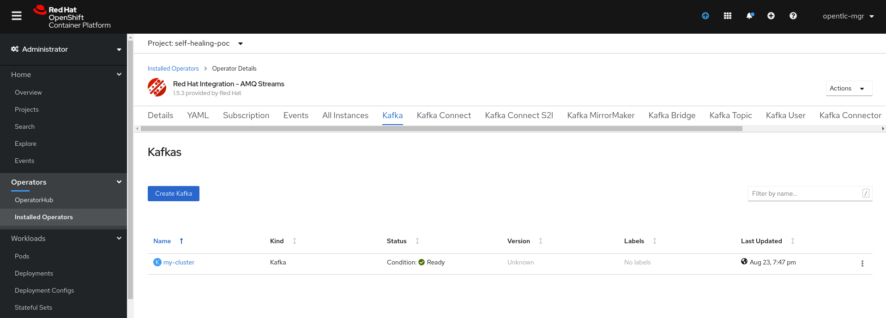
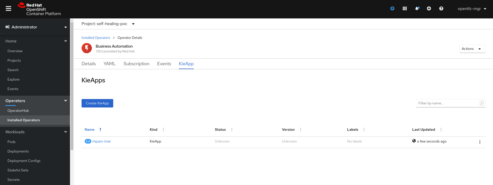
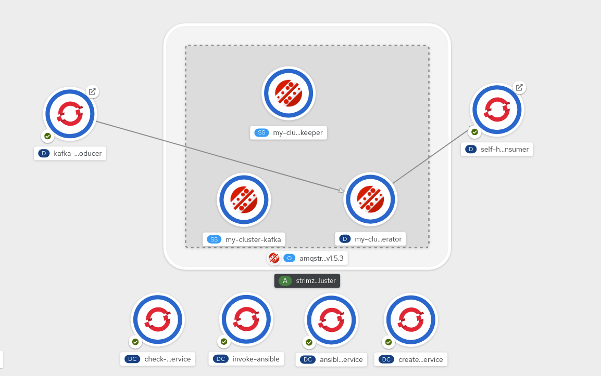

# Self Healing Infrastructure POC

This project prvovides a scripted installation for the various components involved.

## Pre Requisities

+ Ansible Tower instance. The example while this script was written uses the following
ansible tower URL.
```
http://poc.rhdemo.io/
```
+ Openshift instance

## Demo setup
+ Remote login to the remote openshift instance. 
+ Create a new project and install the Red Hat Integration - AMQ Streams operator.
This will setup the 3 node kafka cluster which we will use for the demo.
.   


+ Install the Business Automation operator. We will use this for showcasing the business rules authoring using DMN.
. 

+ On the business central, import project 
```
    https://github.com/snandakumar87/AutomationEventDecision
```
+ Finally invoke the scripted install

```
    sh src/main/resources/provision-self-healing-poc.sh
```

## Demo Environment Verification
Once the deployment completes, we should see a 3 node kafka cluster, 4 micro services, a kafka producer and a kafka consumer.


Check the [link](https://docs.google.com/document/d/1rMdVhcOfXVzWm_oXO0tY0cy3E-CExafMQZo6s-bu7WA/edit#heading=h.66y4kqbj468a) for detailed architectural walkthrough.